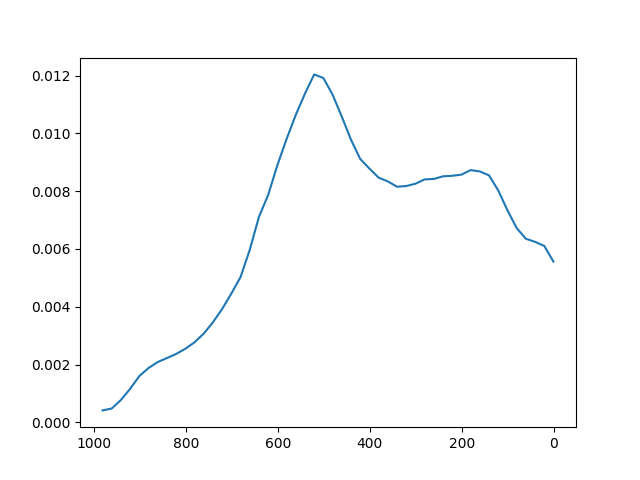
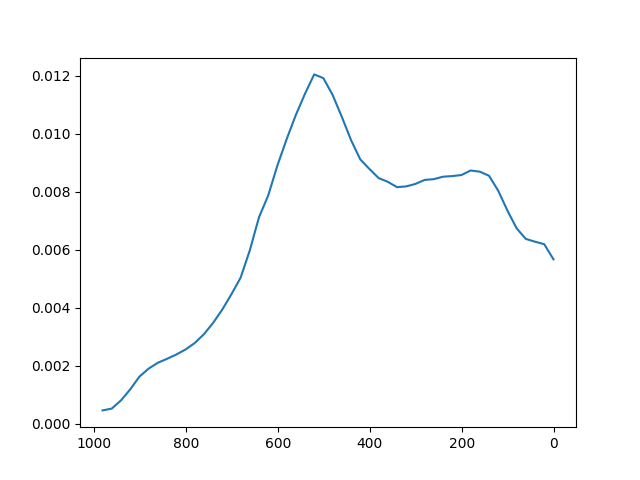
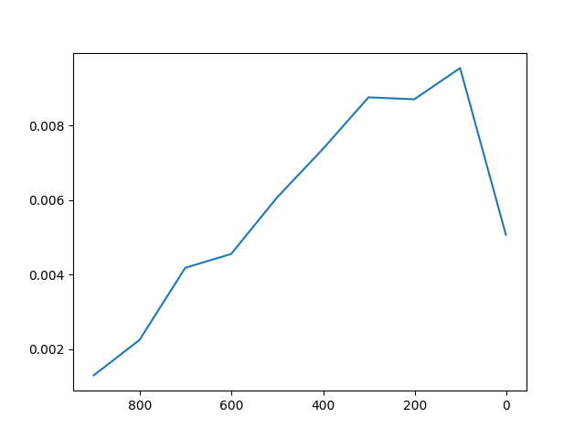
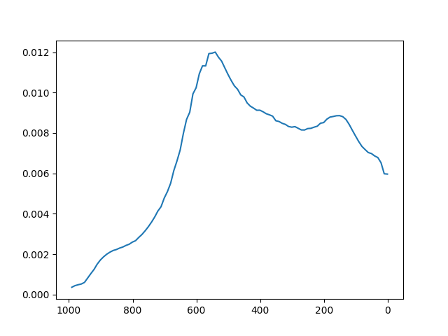

1.通过原生的sample_imgs， (1) 获得[0...T]的noise图像: imgs （2）对应使用到的时间列表t_list_ddpm
2.迭代imgs的长度，取出对应的x_t=imgs[index] 以及时间 t=t_list_ddpm[index]
3.~~差值操作

### functions
1.convert_x_t_to_images_for_vaild(x_t,name='test.png'): 将给定的x_t保存成图像，默认name:'test.png'
2.create_classifier(path): 创建classifier，与openai官方给定的参数不同(跑不起来)，按照权重内的key，强制strict=True来对齐
### results
all defult seed is 42
 

full step: 1000//20==50(interval=1) 

full step: 1000//20==50(interval=1000) 

full step: 1000//100==10(interval=1000) 

full step: 1000//10==1000(interval=1000) 

